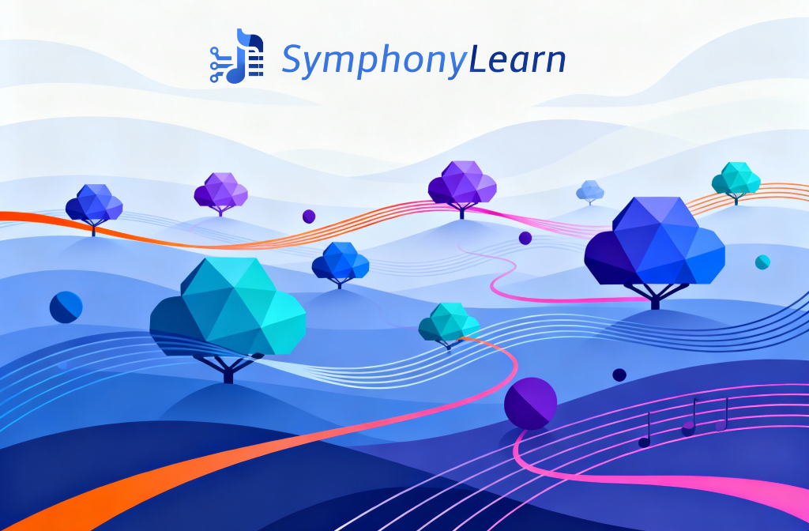

<div align="center">


# SymphonyLearn

#### A Pytorch-native platform for hetetrogenous & decentralized training of large-scale AI models


</div>

## 🧭 Overview
As AI models, especially Large Language Models (LLMs) and Vision-Language Models (VLMs), continue to grow in scale and complexity, the need for heterogeneous and decentralized training strategies is becoming increasingly critical. Training such massive models demands enormous computational resources, which are often inaccessible to most researchers and organizations.

HPC centers around the world host a wide variety of GPUs, ranging across different vendors, architectures, and hardware configurations. However, these variations introduce compatibility and utilization challenges, often preventing AI researchers from seamlessly leveraging multiple HPC systems at once.

This platform demonstrates a practical approach to overcoming these challenges by connecting heterogeneous HPC resources in a decentralized manner using the Diloco algorithm. It enables collaborative, cross-platform AI model training without requiring homogeneous hardware or centralized orchestration. In particular, this platform enables two levels of heterogeneity:

* **Cross-Hardware heterogeneity:**
Train models across multiple hardware platforms—leveraging both PyTorch and DaCe integration. This provides flexibility to exploit various computation resources, regardless of vendor or GPU generation. Supporting efficient training on exotic backends can be supported via extending DaCe.

* **Non-uniform GPU distribution:**
HPC clusters vary widely in their node configurations (commonly with 4 or 8 GPUs per node). Our platform offers native support for varying GPU counts and node structures, allowing seamless scaling across diverse systems.

## 💡 Why Use This Platform?
* Overcome hardware heterogeneity in HPC environments
* Enable decentralized collaboration for large-model training
* Achieve efficient cross-center resource sharing
* Lower the computational and financial barriers to AI research

## 🧪 Tested platforms
We tested and validated heterogenous training on the following platforms:
- [x] Nvidia GPUs (L40S, A100, H100)
- [x] AMD GPUs (MI300X)

## 📑 Documentations
Besides the [Getting started](#-getting-started) section, you can find additional documentations in the [doc](docs/) folder.

- [Detailed installation tutorial](docs/installation.md)
- [Tutorial on adding a new model](docs/model.md)
- [Deployment on Cloud using SkyPilot](docs/skypilot.md)

## 🚀 Getting Started
### Installing the framework
First clone the repository with:
```
git clone --recursive https://github.com/PanocularAI/symphony-learn.git
```
Make sure that you pull all submodules using `--recursive` flag.

To facilitate the installation of the framework, you may run the make file to automatically setup the dependencies and environment.
```
make all
```

However, it might be the case that any of the commands in the makefile fail due to incompatibility with your setup. Therefore, please refer to the detailed [Installation Guideline](docs/installation.md) for installing dependencies and troubleshooting. 

### Setting up Tailscale VPN
To establish communication between different compute islands, each compute node must have a routable public IP address.
If public IPs are not available, it is recommended to use Tailscale. Please follow the [instructions](docs/installation.md#tailscale-setup) to setup the tailscale service on your machine.


### Launch the decentralized training
Here we explain a sample training of a llama3 model on two different islands in a decentralized way. 
For a more detailed explanation, please refer to [Launching Training](docs/distributed.md).

You need to execute the following three commands in different shell sessions:

1. Start the lighthouse engine.
```
RUST_BACKTRACE=1 torchft_lighthouse --bind=<public_ip>:29510 --min_replicas 1 --quorum_tick_ms 100 --join_timeout_ms 10000
```

2. Run the training on the first island:
```
TORCHFT_LIGHTHOUSE=http://<public_ip>:29510 \
NGPU=1 \
LOCAL_ADDR=${LOCAL_ADDR} \
MASTER_ADDR=${MASTER_ADDR} \
MASTER_PORT=29500 \
NNODES=<num_nodes> \
ISHOST=<yes_if_master-no_if_worker> \
GLOO_SOCKET_IFNAME=<network_card> \
NCCL_SOCKET_IFNAME=<network_card> \
CONFIG_FILE="./models/llama3/train_configs/debug_model.toml" \
uv run ./run_train.sh --fault_tolerance.enable --fault_tolerance.replica_id=0 --fault_tolerance.group_size=2
```

3. Run the training on the second island:
```
TORCHFT_LIGHTHOUSE=http://<public_ip>:29510 \
NGPU=1 \
LOCAL_ADDR=<local_ip> \
MASTER_ADDR=<master_c10d_ip> \
MASTER_PORT=29500 \
NNODES=<num_nodes> \
ISHOST=<yes_if_master-no_if_worker> \
GLOO_SOCKET_IFNAME=<network_card> \
NCCL_SOCKET_IFNAME=<network_card> \
CONFIG_FILE="./models/llama3/train_configs/debug_model.toml" \
uv run ./run_train.sh --fault_tolerance.enable --fault_tolerance.replica_id=1 --fault_tolerance.group_size=2
```

## 🤖 Supported models
Currently, we validated the decentralized training of the following [models](models/):

- [x] Llama3
- [x] GPT_OSS
- [x] Resnets

There are many more already added in [TorchTitan models](https://github.com/pytorch/torchtitan/tree/main/torchtitan/models) and [TorchTitan experiment models](https://github.com/pytorch/torchtitan/tree/main/torchtitan/experiments). Moreover, new models can be simply added by following the [Adding a new model tutorial](docs/model.md).

## 🙏 Acknowledgement
This work builds upon the following open-source frameworks:

* [TorchTitan](https://github.com/meta-pytorch/torchtitan) — a PyTorch-native platform for large-scale generative AI model training (Liang et al., ICLR 2025).
* [TorchFT](https://github.com/meta-pytorch/torchft) — a library providing fault-tolerance primitives for distributed PyTorch training (HSDP, LocalSGD, DiLoCo, Streaming DiLoCo).

We gratefully acknowledge the PyTorch, TorchTitan, and TorchFT teams for their foundational contributions to distributed and fault-tolerant ML training infrastructures.

This project is gratefully funded by [federal ministry of breakthrough innovation (SPRIN-D)](https://www.sprind.org/en) under [Composite Learning Challenge](https://www.sprind.org/en/actions/challenges/composite-learning). 